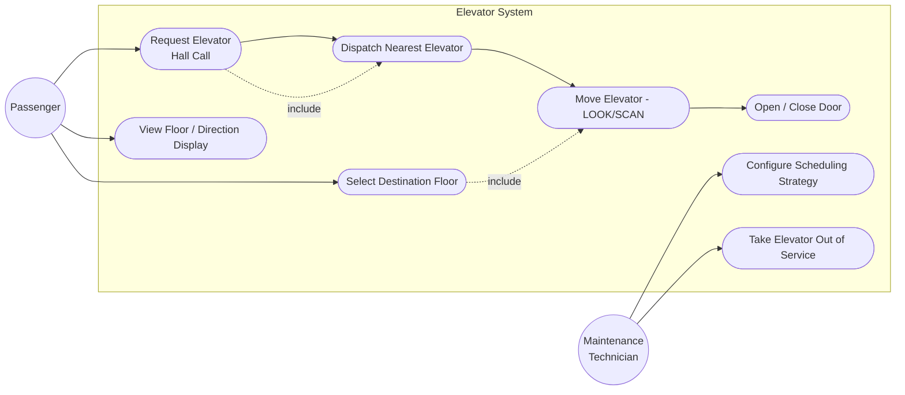
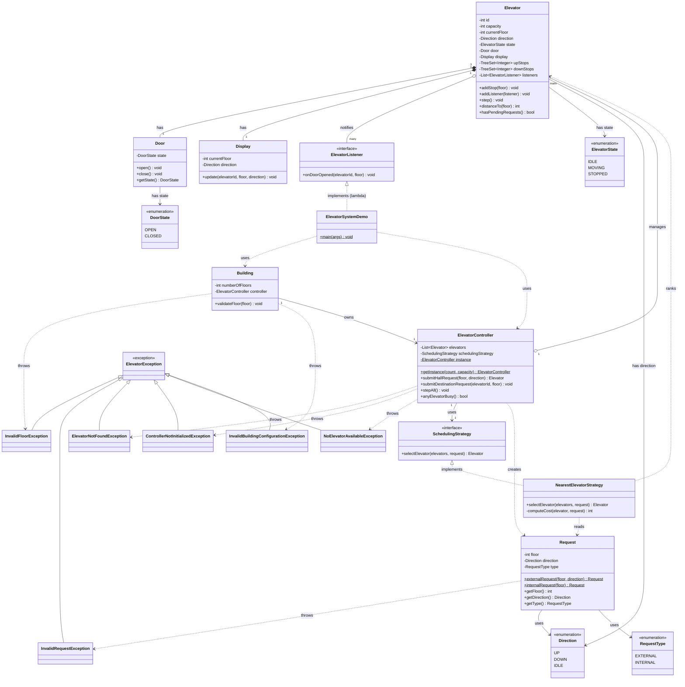
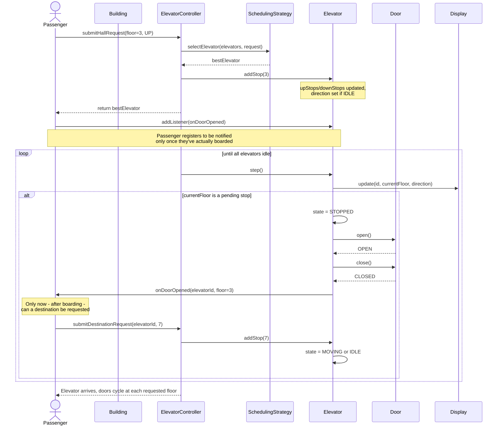
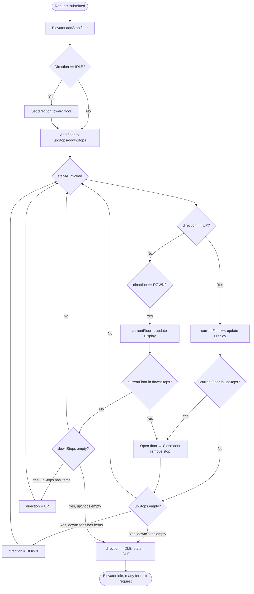

# Elevator System — Low Level Design

A low level design of a multi-elevator (elevator bank) system in Java, modelling
hall calls, destination calls, dispatch scheduling and cabin movement using the
LOOK/SCAN algorithm.

## Table of Contents

1. [Package Structure](#package-structure)
2. [Folder Details](#folder-details)
   - [model](#model)
   - [strategy](#strategy)
   - [controller](#controller)
   - [exception](#exception)
   - [demo](#demo)
   - [test](#test)
3. [Flow of the System](#flow-of-the-system)
4. [Diagrams](#diagrams)
   - [Use Case Diagram](#use-case-diagram)
   - [Class Diagram](#class-diagram)
   - [Sequence Diagram](#sequence-diagram)
   - [Activity Diagram](#activity-diagram)
5. [Design Patterns Used](#design-patterns-used)
6. [Exception Handling](#exception-handling)
7. [Testing](#testing)
8. [Extending the Design](#extending-the-design)
   - [More Scheduling Strategies](#more-scheduling-strategies)
   - [Multithreading](#multithreading)
   - [Concurrency](#concurrency)
   - [Parallelism](#parallelism)

## Package Structure

```
com.lowleveldesign.elevator
├── model
│   ├── Direction.java
│   ├── RequestType.java
│   ├── Request.java
│   ├── DoorState.java
│   ├── Door.java
│   ├── ElevatorState.java
│   ├── Display.java
│   └── Elevator.java
├── strategy
│   ├── SchedulingStrategy.java
│   └── NearestElevatorStrategy.java
├── controller
│   ├── ElevatorController.java
│   └── Building.java
├── exception
│   ├── ElevatorException.java
│   ├── InvalidFloorException.java
│   ├── InvalidRequestException.java
│   ├── ElevatorNotFoundException.java
│   ├── ControllerNotInitializedException.java
│   ├── NoElevatorAvailableException.java
│   └── InvalidBuildingConfigurationException.java
├── demo
│   └── ElevatorSystemDemo.java
└── test
    └── TestRunner.java
```

## Folder Details

### model

Contains the core domain entities — the "nouns" of the system, with no
knowledge of scheduling or dispatch logic.

| Class | Responsibility |
|---|---|
| `Direction` | Enum: `UP`, `DOWN`, `IDLE`. Direction of travel for an elevator or a hall request. |
| `RequestType` | Enum: `EXTERNAL` (hall call from a floor) vs `INTERNAL` (destination call from inside the cabin). |
| `Request` | Immutable value object representing a single call. Built via factory methods `externalRequest(floor, direction)` and `internalRequest(floor)` so invalid combinations (e.g. a hall call with `IDLE` direction) can't be constructed. |
| `DoorState` | Enum: `OPEN`, `CLOSED`. |
| `Door` | Models the cabin door. Deliberately simple (no timers/threads) so behaviour is deterministic and testable. |
| `ElevatorState` | Enum: `IDLE`, `MOVING`, `STOPPED` — the elevator's current activity. |
| `Display` | Cosmetic component reflecting an elevator's latest floor/direction (simulates the floor/cabin indicator panel). |
| `Elevator` | The core cabin. Maintains two `TreeSet<Integer>` queues (`upStops`, `downStops`) and implements the **LOOK/SCAN** algorithm via `step()`, moving one floor at a time and opening the door whenever it reaches a pending stop. |

### strategy

Contains the dispatch/scheduling logic — decoupled from the `Elevator` and
`ElevatorController` so new algorithms can be dropped in without touching
either.

| Class | Responsibility |
|---|---|
| `SchedulingStrategy` | Interface: `selectElevator(List<Elevator>, Request)`. |
| `NearestElevatorStrategy` | Default implementation. Prefers idle elevators (ranked by distance), then elevators already travelling toward the request in the same direction, and penalizes elevators moving away/opposite so they're only chosen as a last resort. |

### controller

Contains the orchestration layer — the "brain" that owns all elevators and
exposes the public API a building's panels would call into.

| Class | Responsibility |
|---|---|
| `ElevatorController` | Singleton. Owns the list of `Elevator`s, receives `submitHallRequest`/`submitDestinationRequest` calls, delegates elevator selection to the configured `SchedulingStrategy`, and advances all elevators each simulation tick via `stepAll()`. |
| `Building` | Thin wrapper representing the building: validates floor bounds and lazily initializes the `ElevatorController` singleton with the elevator count/capacity. |

### exception

Contains the custom exception hierarchy. All failures extend a single base
type so callers can catch broadly or narrowly as needed.

| Class | Thrown when |
|---|---|
| `ElevatorException` | Base type (extends `RuntimeException`). Never thrown directly — lets callers `catch (ElevatorException e)` to handle any elevator failure uniformly. |
| `InvalidFloorException` | A requested floor is outside the building's range (`< 0` or `>= numberOfFloors`). Carries the offending floor and the valid range in its message. |
| `InvalidRequestException` | A request is malformed — notably a hall call raised with `Direction.IDLE`, which is meaningless. |
| `ElevatorNotFoundException` | A destination request references an elevator id that doesn't exist in the bank. |
| `ControllerNotInitializedException` | The no-arg `ElevatorController.getInstance()` is called before the singleton has been initialized with a count/capacity. |
| `NoElevatorAvailableException` | The `SchedulingStrategy` returned no elevator (empty bank, all cars out of service, or out of zone). Prevents an opaque `NullPointerException` far from the real cause. |
| `InvalidBuildingConfigurationException` | A `Building` is constructed with a non-positive floor count, elevator count, or capacity — fails fast at construction. |

### demo

| Class | Responsibility |
|---|---|
| `ElevatorSystemDemo` | `main()` entry point. Builds a `Building`, submits a couple of hall calls and destination calls, then loops calling `stepAll()` until every elevator is idle — printing floor-by-floor movement, door events, and the final state of each elevator. |

### test

| Class | Responsibility |
|---|---|
| `TestRunner` | Dependency-free unit test suite (no JUnit/build tool required, consistent with `com.lowleveldesign.meetingscheduler.test.TestRunner`). Covers `Request`, `Door`, `Display`, `Elevator` (LOOK ordering, direction reversal, idle transitions, listener timing), `NearestElevatorStrategy`, `ElevatorController`, and `Building`. See [Testing](#testing) for how to run it. |

## Flow of the System

1. **Building setup** — `Building` is constructed with floor count, elevator
   count and per-elevator capacity. It initializes the `ElevatorController`
   singleton, which in turn creates the `Elevator` instances (each starting
   `IDLE` at floor 0).
2. **Hall call** — A passenger presses UP/DOWN on a floor →
   `ElevatorController.submitHallRequest(floor, direction)` creates an
   `EXTERNAL` `Request` and asks the `SchedulingStrategy` to pick the best
   `Elevator`. The chosen elevator adds the floor to its `upStops`/`downStops`
   queue via `addStop()`, and its `direction` flips from `IDLE` if needed.
3. **Destination call (temporally gated)** — A passenger's destination button
   press must only be honored *after* they've actually boarded, i.e. after the
   elevator opens its doors at their pickup floor — never before. Rather than
   the caller submitting the destination request eagerly, `Elevator` exposes
   `addListener(ElevatorListener)` (Observer pattern) and notifies listeners
   from `openDoorAt()` once the doors have opened. Callers (e.g. the demo,
   standing in for a passenger) register a listener on the specific elevator
   returned by `submitHallRequest(...)`, and only call
   `ElevatorController.submitDestinationRequest(elevatorId, floor)` once
   notified — this creates an `INTERNAL` `Request` and adds it directly to
   that elevator's stop queue (no scheduling decision needed, since the cabin
   is already fixed).
4. **Movement (LOOK/SCAN)** — Each simulation tick, `ElevatorController.stepAll()`
   calls `Elevator.step()` on every busy elevator. An elevator moving `UP`
   keeps incrementing its floor and serving every stop in `upStops` before
   reversing to `downStops` (and vice versa) — this avoids starvation and
   minimizes needless direction reversals.
5. **Arrival** — When the current floor matches a pending stop, the elevator
   transitions to `STOPPED`, opens the `Door`, closes it, and resumes if more
   stops remain, or goes `IDLE` if the queues are empty.
6. **Termination** — The demo loop calls `stepAll()` until
   `ElevatorController.anyElevatorBusy()` returns `false`, meaning all
   elevators have served every request and returned to `IDLE`.

```
Passenger → Building → ElevatorController → SchedulingStrategy → Elevator.addStop()
                                                                        │
                                                              ElevatorController.stepAll()
                                                                        │
                                                    Elevator.step() (LOOK) → Door open/close → notify ElevatorListener(s)
                                                                        │
                                                          (passenger boards) → submitDestinationRequest() → Elevator.addStop()
```

> **Why the ordering matters:** without gating destination requests behind an
> arrival callback, a naive simulation could submit a destination call for a
> floor that is numerically *between* the elevator's current position and the
> passenger's pickup floor. Since `Elevator.addStop()` only compares floor
> numbers, that destination would be queued and served *before* the elevator
> ever reaches the pickup floor — i.e. dropping off a passenger who hasn't
> boarded yet. The `ElevatorListener` callback closes this gap by ensuring a
> destination can only be raised once the corresponding pickup has actually
> been served.

## Diagrams

> Diagrams are written in [Mermaid](https://mermaid.js.org/) and render
> natively on GitHub. If your viewer doesn't support Mermaid, paste the code
> blocks into the [Mermaid Live Editor](https://mermaid.live).

### Use Case Diagram



- **Passenger** raises hall calls (`Request Elevator`) and destination calls
  (`Select Destination Floor`), and observes the `Display`.
- **Maintenance Technician** represents an administrative actor that can swap
  the `SchedulingStrategy` or pull an elevator out of service (a natural
  extension point on `ElevatorController`).
- `Dispatch Nearest Elevator` and `Move Elevator` are system-driven use cases
  triggered as a consequence of passenger actions (`include` relationships).

### Class Diagram



### Sequence Diagram

Hall call, followed by a destination call that is correctly gated until
*after* boarding (via `ElevatorListener`), through to elevator arrival:



### Activity Diagram

Lifecycle of a single elevator's `step()` execution under the LOOK/SCAN
algorithm:



## Design Patterns Used

| Pattern | Where | Why |
|---|---|---|
| **Singleton** | `ElevatorController` | There should be exactly one controller coordinating all elevators in a building — duplicate controllers could double-dispatch the same hall call or lose track of elevator state. `getInstance(...)` guarantees a single shared coordination point, analogous to a single physical dispatch panel. |
| **Strategy** | `SchedulingStrategy` / `NearestElevatorStrategy` | Elevator dispatch algorithms vary widely in practice (nearest car, zoning, destination-dispatch, load balancing). Extracting selection logic behind an interface lets `ElevatorController` remain unchanged while algorithms are swapped via `setSchedulingStrategy()` — open for extension, closed for modification. |
| **Static Factory Method** | `Request.externalRequest(...)` / `Request.internalRequest(...)` | A hall call must always have a real direction (`UP`/`DOWN`), while a destination call has none. Private constructor + named factories prevent illegal states (e.g. an `EXTERNAL` request with `IDLE` direction) from ever being constructed, which a public constructor with optional/nullable fields would not guarantee. |
| **Facade** | `ElevatorController` | Hides the complexity of elevator selection, stop-queue management, and stepping behind two simple entry points (`submitHallRequest`, `submitDestinationRequest`) that callers (hall panels, cabin panels, the demo) use without knowing internal scheduling details. |
| **State (implicit, via enums)** | `ElevatorState`, `DoorState`, `Direction` | Rather than a full State pattern with polymorphic classes, lightweight enums represent the finite states of an elevator/door. This keeps the object graph simple while still making illegal states (e.g. "moving" with no direction) easy to guard against, appropriate since transition logic is small and centralized in `Elevator`. |
| **Immutable Value Object** | `Request` | Once a request is created it never changes — floor, direction and type are `final`. Immutability makes requests safe to pass around, hash/compare (`equals`/`hashCode`), and reason about without defensive copying. |
| **Observer** | `ElevatorListener` / `Elevator.addListener(...)` | A destination request is only physically valid *after* a passenger has boarded, which happens the moment the doors open at their pickup floor. `Elevator` notifies registered `ElevatorListener`s from `openDoorAt()`, letting callers react to that exact moment instead of guessing timing — this is what prevents a destination floor from being served before the corresponding pickup. |

## Exception Handling

All failures are represented by domain-specific exceptions in the
[`exception`](#exception) package rather than generic JDK types, and all of
them extend a single base class:

```
RuntimeException
└── ElevatorException
    ├── InvalidFloorException
    ├── InvalidRequestException
    ├── ElevatorNotFoundException
    ├── ControllerNotInitializedException
    ├── NoElevatorAvailableException
    └── InvalidBuildingConfigurationException
```

**Where each is thrown:**

| Site | Exception | Replaces |
|---|---|---|
| `Request.externalRequest(floor, IDLE)` | `InvalidRequestException` | `IllegalArgumentException` |
| `Building.validateFloor(...)` — and therefore both `Building.submitHallRequest` / `submitDestinationRequest` | `InvalidFloorException` | `IllegalArgumentException` |
| `Building` constructor (floors/elevators/capacity ≤ 0) | `InvalidBuildingConfigurationException` | *(previously unvalidated)* |
| `ElevatorController.getInstance()` before init | `ControllerNotInitializedException` | `IllegalStateException` |
| `ElevatorController.getElevator(unknownId)` | `ElevatorNotFoundException` | `IllegalArgumentException` |
| `ElevatorController.submitHallRequest(...)` when the strategy selects nothing | `NoElevatorAvailableException` | *(previously an eventual `NullPointerException`)* |

**Design rationale:**

- **Domain-specific over generic** — `catch (InvalidFloorException e)` conveys
  intent that `catch (IllegalArgumentException e)` cannot, and can't
  accidentally catch an unrelated argument error thrown from deep inside a JDK
  call.
- **Common supertype** — a UI or API layer that simply wants to convert any
  elevator failure into an error response can catch `ElevatorException` once
  instead of enumerating six types. Verified by a dedicated test.
- **Unchecked (`RuntimeException`)** — these represent programming/usage errors
  and unsatisfiable requests, not recoverable I/O conditions, so forcing
  `throws` clauses through every call site would add noise without value.
  This also matches the existing convention in
  `com.lowleveldesign.meetingscheduler.exception`.
- **Messages built inside the exception** — e.g. `InvalidFloorException(floor,
  numberOfFloors)` formats the valid range itself, so every throw site produces
  a consistent, informative message instead of hand-rolled strings.
- **Fail fast** — `InvalidBuildingConfigurationException` and
  `NoElevatorAvailableException` were added specifically to surface problems at
  their origin, rather than letting a zero-elevator building or a null strategy
  result blow up later with an unhelpful stack trace.

## Testing

`com.lowleveldesign.elevator.test.TestRunner` is a dependency-free unit test
suite (32 tests) — no JUnit, Maven or Gradle required, matching the existing
convention in this repository.

**Run from the repository root:**

```bash
javac -d out $(find src/com/lowleveldesign/elevator -name "*.java")
java -cp out com.lowleveldesign.elevator.test.TestRunner
```

PowerShell equivalent:

```powershell
$files = Get-ChildItem -Recurse src\com\lowleveldesign\elevator -Filter *.java | % FullName
javac -d out $files
java -cp out com.lowleveldesign.elevator.test.TestRunner
```

It prints `[PASS]`/`[FAIL]` per test and exits non-zero if anything fails, so
it can be dropped into CI as-is.

**Coverage by area:**

| Area | What is verified |
|---|---|
| `Request` | `externalRequest` rejects an `IDLE` direction; both factories populate floor/direction/type correctly; `equals`/`hashCode` contract; `toString` distinguishes hall calls from destinations. |
| `Door` / `Display` | Door starts `CLOSED` and transitions correctly on `open()`/`close()`; display always reflects the most recent `update()`. |
| `Elevator` (LOOK/SCAN) | Correct initial state; a same-floor stop opens the door immediately; multiple stops are served in ascending LOOK order; the elevator **reverses** direction rather than idling when the opposite queue still has stops; returns to `IDLE` once drained; `distanceTo`, `hasPendingRequests`, `isIdle`, `getCapacity`. |
| Listener timing | The listener fires **only on arrival**, never on intermediate floors — plus a dedicated regression test (`testNoDropOffBeforeBoarding`) asserting a destination floor is never queued or served before the pickup floor is reached. |
| `NearestElevatorStrategy` | Prefers the closest idle elevator; prefers an elevator already travelling toward the request over a farther idle one; penalizes an elevator moving away/opposite. |
| `ElevatorController` | No-arg `getInstance()` throws before initialization; the singleton returns the same shared instance (and ignores later constructor args); hall requests dispatch and return the chosen elevator; destination requests queue on the target elevator; unknown elevator id throws; `stepAll()` advances only busy elevators; `setSchedulingStrategy()` genuinely swaps the dispatch algorithm. |
| `Building` | `validateFloor` rejects floors `< 0` and `>= numberOfFloors`; both `submitHallRequest` and `submitDestinationRequest` enforce those bounds before dispatching. |
| Custom exceptions | The `Building` constructor rejects non-positive floors/elevators/capacity; `NoElevatorAvailableException` is raised when a strategy selects nothing; every failure is catchable via the shared `ElevatorException` supertype and is unchecked. |

> **Note on testing a Singleton:** because `ElevatorController` caches a
> private static `instance`, each test needs a clean slate. Rather than adding
> a production-only `reset()` method that exists solely for tests, the runner
> clears that field reflectively between test cases — keeping the production
> API honest while still allowing isolated tests. This is a good illustration
> of the testability trade-off the Singleton pattern imposes.

## Extending the Design

### More Scheduling Strategies

Because dispatch logic is isolated behind `SchedulingStrategy`, new
algorithms are additive — no existing class needs modification:

- **Zoning**: assign elevators to floor ranges (e.g. low-rise/high-rise) and
  filter candidates by zone before ranking by distance.
- **Destination Dispatch**: change `submitHallRequest` to accept the
  passenger's actual destination up front (common in modern high-rises) and
  group passengers heading to nearby floors into the same cabin to reduce
  stops.
- **Load-aware dispatch**: extend `Elevator` with a current passenger count
  and have the strategy skip/deprioritize elevators near `capacity`.
- **Estimated Time of Arrival (ETA) strategy**: instead of raw floor distance,
  estimate travel time factoring in pending stops ahead of the requested
  floor, door-open dwell time, etc.

Adding one of these only requires a new class implementing
`SchedulingStrategy` and calling
`elevatorController.setSchedulingStrategy(new YourStrategy())` — the
`Elevator` and `ElevatorController` classes require no changes.

### Multithreading

Currently, `ElevatorController.stepAll()` advances every elevator
sequentially on a single thread (suitable for a deterministic simulation/demo).
To model elevators as independent physical machines:

- Give each `Elevator` its own thread (or run each on a scheduled
  `ExecutorService` task) so cabins move simultaneously and independently
  rather than in lock-step within `stepAll()`.
- Replace the synchronous `step()` polling loop with each elevator running
  its own loop: sleep for a fixed tick interval, then `step()`, repeating
  until idle, decoupling elevator speed from the demo loop.
- Hall/destination request submission would happen from separate "passenger"
  threads (or a request-generating simulator) calling into the shared
  `ElevatorController` concurrently.

### Concurrency

Once multiple threads submit requests and/or drive elevators independently,
shared mutable state must be protected:

- `ElevatorController.elevators` (list) and `schedulingStrategy` (reference)
  should be guarded — e.g. use a `CopyOnWriteArrayList` for elevators (rarely
  mutated, frequently read) and `volatile`/synchronized accessors for the
  active strategy so a strategy swap is visible across dispatch threads.
- `Elevator`'s internal `upStops`/`downStops` `TreeSet`s are not thread-safe.
  If a hall-call thread calls `addStop()` while the elevator's own thread is
  concurrently running `step()`, this must be protected — either by making
  `Elevator` synchronize its own mutating methods (`addStop`, `step`) or by
  funneling all mutations through a per-elevator queue/mailbox (e.g. a
  `BlockingQueue<Request>`) that only the elevator's own thread drains,
  avoiding shared-state locking entirely.
- The scheduling decision in `NearestElevatorStrategy.selectElevator()` reads
  elevator state (`getDirection()`, `getCurrentFloor()`) that could be
  changing concurrently; a consistent snapshot (e.g. reading fields once into
  locals, or having `Elevator` expose an immutable state snapshot object)
  avoids torn reads during ranking.
- `ElevatorController.getInstance()` is already `synchronized` for safe lazy
  singleton initialization, but if request submission becomes hot-path/high
  frequency, consider double-checked locking or eager initialization to avoid
  contention on every call.

### Parallelism

With multithreading and concurrency handled, true parallel execution becomes
possible:

- **Independent elevator movement**: since each `Elevator`'s `step()` only
  touches its own state, elevators can genuinely run in parallel across CPU
  cores (e.g. via a thread pool sized to the number of elevators) with no
  cross-elevator locking needed — only the shared `ElevatorController` list
  lookups need synchronization.
- **Parallel strategy evaluation**: `NearestElevatorStrategy.selectElevator()`
  currently ranks elevators sequentially; for very large elevator banks this
  loop could use `parallelStream()` to compute costs concurrently before
  reducing to the minimum, since each elevator's cost calculation is
  independent and side-effect free.
- **Simulation scaling**: for load-testing the dispatch algorithm against
  many simulated passengers, request generation and elevator stepping could
  run on separate thread pools, with the `ElevatorController` acting as the
  synchronization boundary between them.
