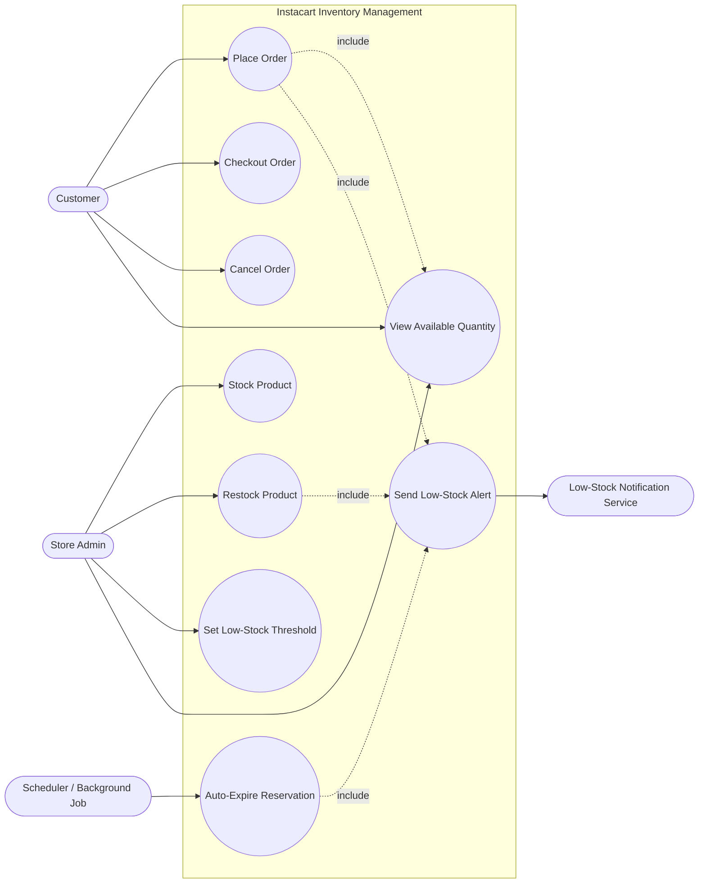
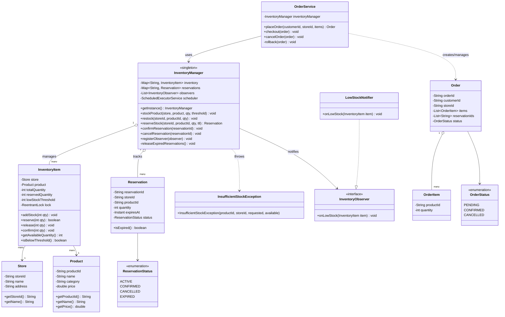
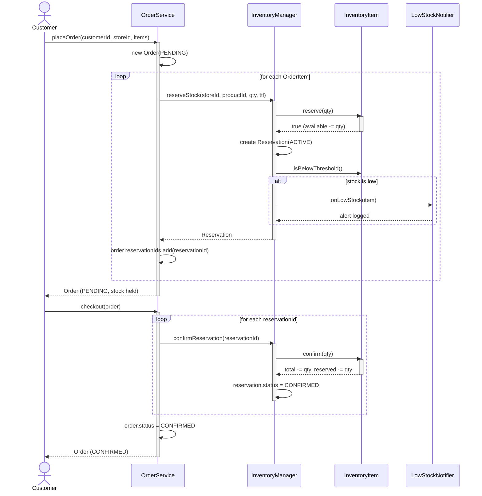
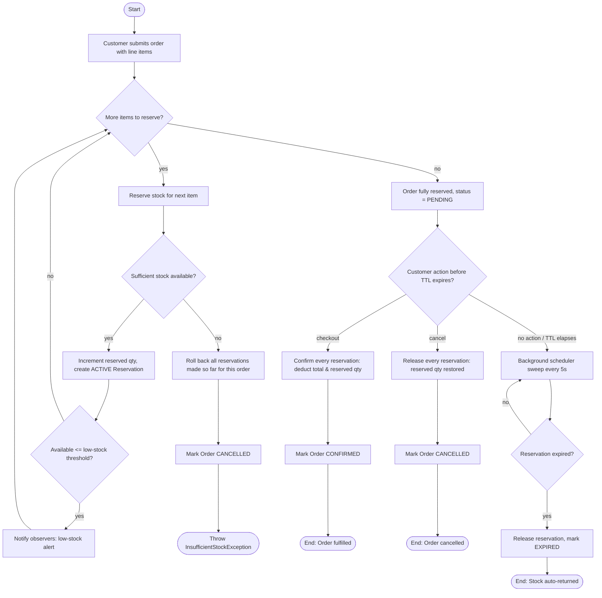

# Instacart Inventory Management — Low Level Design

A Java implementation of a multi-store inventory management system modeled on
Instacart: products are stocked per store, shoppers place orders that place a
temporary **hold** on stock, and stock is only permanently deducted at
checkout. Includes thread-safe concurrency handling, automatic hold expiry,
and low-stock alerting.

## Table of Contents

1. [Package Structure](#package-structure)
2. [Folder / Class Details](#folder--class-details)
   - [model/](#model)
   - [inventory/](#inventory)
   - [order/](#order)
   - [observer/](#observer)
   - [Main.java](#mainjava)
3. [Flow of the System](#flow-of-the-system)
   - [Stocking a Product](#1-stocking-a-product)
   - [Placing an Order (Reservation)](#2-placing-an-order-reservation)
   - [Checkout (Confirmation)](#3-checkout-confirmation)
   - [Cancellation / Expiry (Release)](#4-cancellation--expiry-release)
4. [Design Patterns Used](#design-patterns-used)
5. [Diagrams](#diagrams)
   - [Use Case Diagram](#use-case-diagram)
   - [Class Diagram](#class-diagram)
   - [Sequence Diagram](#sequence-diagram)
   - [Activity Diagram](#activity-diagram)
6. [Extending the Design](#extending-the-design)
   - [More Strategies](#more-strategies)
   - [Multithreading](#multithreading)
   - [Concurrency](#concurrency)
   - [Parallelism / Scaling Out](#parallelism--scaling-out)

---

## Package Structure

```
com.lowleveldesign.instacart
├── Main.java                     Demo / entry point
├── model/
│   ├── Product.java               Catalog item (shared across stores)
│   └── Store.java                 Physical fulfillment location
├── inventory/
│   ├── InventoryItem.java         Stock record for one (store, product) pair
│   ├── Reservation.java           A temporary hold on stock
│   ├── ReservationStatus.java     ACTIVE / CONFIRMED / CANCELLED / EXPIRED
│   ├── InsufficientStockException.java
│   └── InventoryManager.java      Singleton facade — the core engine
├── order/
│   ├── Order.java                 Aggregate: customer + store + line items
│   ├── OrderItem.java              One (productId, quantity) line
│   ├── OrderStatus.java            PENDING / CONFIRMED / CANCELLED
│   └── OrderService.java           Orchestrates order lifecycle
└── observer/
    ├── InventoryObserver.java     Callback contract for inventory events
    └── LowStockNotifier.java      Concrete observer that logs low-stock alerts
```

---

## Folder / Class Details

### `model/`
Holds simple, immutable domain entities with no business logic:

- **`Product`** — a catalog SKU (`productId`, `name`, `category`, `price`). Equality is by `productId`. Shared across all stores — the same product can exist in many stores' inventories.
- **`Store`** — a physical fulfillment location (`storeId`, `name`, `address`). Each store carries its own independent stock levels.

### `inventory/`
The heart of the system — stock bookkeeping and the public API for reserving/consuming it.

- **`InventoryItem`** — stock for exactly one `(Store, Product)` pair. Tracks `totalQuantity` (physically on shelf) and `reservedQuantity` (held by active carts); `availableQuantity = total - reserved`. Exposes atomic `reserve()`, `release()`, `confirm()`, `addStock()` operations, each guarded by a private `ReentrantLock` so concurrent operations on the *same* item are safe without blocking unrelated items.
- **`Reservation`** — a temporary hold created when stock is reserved: `reservationId`, `storeId`, `productId`, `quantity`, `createdAt`/`expiresAt`, and a `status`. Reservations auto-expire (see `InventoryManager`) if never confirmed or cancelled.
- **`ReservationStatus`** — enum: `ACTIVE`, `CONFIRMED`, `CANCELLED`, `EXPIRED`.
- **`InsufficientStockException`** — thrown when a reservation request exceeds available stock.
- **`InventoryManager`** — a singleton facade that is the single source of truth for all stock. Responsibilities:
  - `stockProduct` / `restock` — onboard or top up stock.
  - `reserveStock` — hold stock for a cart/order (fails fast via `InsufficientStockException`).
  - `confirmReservation` — permanently deduct stock at checkout.
  - `cancelReservation` — release a hold back to the available pool.
  - Runs a background `ScheduledExecutorService` that sweeps every 5 seconds to auto-release **expired** reservations (abandoned carts).
  - Maintains a list of `InventoryObserver`s and notifies them when an item's available quantity drops to/below its `lowStockThreshold`.

### `order/`
Orchestrates the customer-facing order lifecycle on top of `InventoryManager`, without leaking inventory locking details.

- **`OrderItem`** — one requested line: `productId` + `quantity`.
- **`Order`** — aggregate for a customer's order at one store: `orderId`, `customerId`, `storeId`, `items`, the list of `reservationIds` created for it, and its `status`.
- **`OrderStatus`** — enum: `PENDING`, `CONFIRMED`, `CANCELLED`.
- **`OrderService`** — the use-case layer:
  - `placeOrder` — reserves stock for *every* line item; if any single reservation fails, it rolls back all reservations already made for that order (all-or-nothing semantics).
  - `checkout` — confirms all reservations for an order (permanent deduction).
  - `cancelOrder` — releases all reservations for an order.

### `observer/`
Decouples "what happens when stock runs low" from the core inventory logic.

- **`InventoryObserver`** — interface with `onLowStock(InventoryItem)`.
- **`LowStockNotifier`** — a concrete observer that prints an alert; a stand-in for real integrations (email, Slack, supplier reorder API, etc.).

### `Main.java`
Runnable demo: stocks two products at a store, registers a `LowStockNotifier`, places an order (reserves stock), checks out (confirms + deducts, triggering a low-stock alert), then attempts an oversized order to show atomic rollback on failure.

---

## Flow of the System

### 1. Stocking a Product
`InventoryManager.stockProduct(store, product, quantity, lowStockThreshold)` creates (or tops up) an `InventoryItem` for that `(store, product)` pair. Supplier restocks later call `restock(storeId, productId, quantity)`.

### 2. Placing an Order (Reservation)
`OrderService.placeOrder(customerId, storeId, items)`:
1. Creates a `PENDING` `Order`.
2. For each `OrderItem`, calls `InventoryManager.reserveStock(...)`, which atomically checks `available >= requested` and, if so, increments `reservedQuantity` and creates a `Reservation` (`ACTIVE`, with a 15-minute TTL).
3. If any line item cannot be reserved (`InsufficientStockException`), **all reservations already made for this order are rolled back** (released) and the order is marked `CANCELLED` — the whole order either fully reserves or fails cleanly.
4. Observers are notified if the reservation pushed an item at/below its low-stock threshold.

### 3. Checkout (Confirmation)
`OrderService.checkout(order)` calls `InventoryManager.confirmReservation(reservationId)` for every reservation on the order. This moves stock from "reserved" to permanently "removed" (`totalQuantity -= quantity`, `reservedQuantity -= quantity`) and marks the order `CONFIRMED`.

### 4. Cancellation / Expiry (Release)
Two paths return held stock to the available pool without consuming it:
- **Explicit cancel**: `OrderService.cancelOrder(order)` → `cancelReservation` for each reservation.
- **Automatic expiry**: `InventoryManager`'s background scheduler runs every 5 seconds, finds any `ACTIVE` reservation past its `expiresAt`, releases its stock, and marks it `EXPIRED` — this models an abandoned Instacart cart.

```
stockProduct/restock ──► InventoryItem (total ↑)
                              │
placeOrder ──reserveStock──► reserve() (reserved ↑, available ↓) ──► Reservation(ACTIVE)
                              │                                            │
                    checkout │                                cancel/expiry│
                              ▼                                            ▼
                     confirm() (total ↓, reserved ↓)          release() (reserved ↓, available ↑)
                     Reservation(CONFIRMED)                    Reservation(CANCELLED/EXPIRED)
```

---

## Design Patterns Used

| Pattern | Class(es) | Why it was chosen |
|---|---|---|
| **Singleton** | `InventoryManager` | Stock levels must have exactly one authoritative source of truth. A singleton ensures every caller (order flow, admin restock tools, background expiry job) reads/writes the same shared state, avoiding split-brain inventory counts. |
| **Facade** | `InventoryManager` | Exposes a small, intention-revealing API (`reserveStock`, `confirmReservation`, `cancelReservation`, `restock`) over the more complex internals (locking, key-building, reservation bookkeeping, observer notification), so callers like `OrderService` don't need to know how stock is stored or locked. |
| **Observer** | `InventoryObserver` (interface), `LowStockNotifier` (concrete observer), `InventoryManager` (subject) | Low-stock handling (alerting, auto-reorder, analytics) is a cross-cutting concern that shouldn't be hardcoded into inventory logic. Observer decouples "stock changed" from "what to do about it" — new reactions can be added by registering a new observer, with zero changes to `InventoryManager`. |
| **Value Object** | `Product`, `Store`, `OrderItem` | These are simple, immutable, equality-by-id data holders with no behavior — kept separate from the stateful, lockable `InventoryItem` to keep concurrency concerns isolated to where mutation actually happens. |
| **Service / Orchestrator (Application Service)** | `OrderService` | Coordinates multi-step, multi-item workflows (reserve-all-or-rollback, confirm-all, cancel-all) across the `InventoryManager` API. Keeps transactional/workflow logic out of `InventoryManager`, which only needs to reason about a single reservation at a time. |
| **State** (via enum) | `ReservationStatus`, `OrderStatus` | Reservations and orders move through a well-defined lifecycle (`ACTIVE → CONFIRMED/CANCELLED/EXPIRED`, `PENDING → CONFIRMED/CANCELLED`). Modeling this explicitly as enums (rather than booleans/flags) makes illegal states harder to represent and transitions self-documenting. |
| **Fine-grained Locking (Lock-per-Resource idiom)** | `InventoryItem` (`ReentrantLock`) | Rather than one global lock (which would serialize unrelated products/stores), each `InventoryItem` owns its own lock, so operations on different products/stores proceed fully in parallel. This is a concurrency *idiom* rather than a GoF pattern, but is central to the design. |

---

## Diagrams

### Use Case Diagram

Actors: **Customer** (places/cancels orders), **Store Admin** (stocks/restocks products, sets thresholds), and a **Scheduler** (system actor that auto-expires reservations). The **Low-Stock Notification Service** is a secondary system actor notified by the low-stock use case.



### Class Diagram

Core relationships across `model`, `inventory`, `order`, and `observer` packages.



### Sequence Diagram

Happy path: a customer places an order for multiple items, then checks out.



### Activity Diagram

End-to-end order workflow, including the all-or-nothing reservation rollback and the background expiry path.



---

## Extending the Design

### More Strategies
The current design deliberately keeps a few extension seams open for a **Strategy pattern**:

- **Allocation strategy** — when a product is out of stock at the requested store, introduce an `AllocationStrategy` interface (`findAlternative(product, preferredStore)`) with implementations like `NearestStoreStrategy`, `CheapestStoreStrategy`, or `FastestFulfillmentStrategy`. `OrderService` would delegate to the configured strategy instead of failing outright.
- **Replenishment strategy** — add a `ReplenishmentStrategy` interface (e.g. `ReorderPointStrategy`, `EconomicOrderQuantityStrategy`) invoked from a new `onLowStock` observer to automatically place supplier restock requests instead of just alerting.
- **Reservation TTL strategy** — TTL is currently a fixed constant in `OrderService`; extracting a `ReservationPolicy` interface would allow different hold durations per product category (e.g. shorter TTL for high-demand perishables) or per customer tier.
- **Pricing / substitution strategy** — a `SubstitutionStrategy` could suggest a similar `Product` when the requested one is unavailable, plugged into `OrderService.placeOrder`.

All of these follow the same shape: define an interface, inject an implementation into `InventoryManager`/`OrderService` (constructor or setter), and swap implementations without touching core reserve/confirm/release logic.

### Multithreading
The design is already safe under concurrent access from multiple threads:

- Each `InventoryItem` uses its own `ReentrantLock`, so reserve/confirm/release/addStock on one product never blocks operations on a different product — enabling high thread throughput across a large catalog.
- `InventoryManager` uses `ConcurrentHashMap` for both the inventory table and reservation table, and `CopyOnWriteArrayList` for observers (safe for infrequent writes / frequent reads).
- A dedicated background thread (`ScheduledExecutorService`) sweeps expired reservations without blocking request-handling threads.

To extend further: move the expiry sweep to a per-item lazy check (check-on-access) in addition to the periodic sweep, to shrink the worst-case staleness window without increasing sweep frequency/thread count.

### Concurrency
Beyond raw thread-safety, correctness under concurrent *business* operations can be extended by:

- **Optimistic concurrency control**: add a `version` field to `InventoryItem` and use compare-and-swap (`AtomicInteger`/`AtomicStampedReference`) instead of `ReentrantLock` for even lower contention on hot products (e.g. viral/flash-sale items).
- **Idempotency keys**: `confirmReservation`/`cancelReservation` could accept a client-supplied idempotency key so retried network calls (common in distributed order flows) don't double-confirm/double-release.
- **Distributed locks**: if `InventoryManager` is scaled across multiple JVM instances, the in-memory `ReentrantLock` must be replaced with a distributed lock (e.g. Redis `SETNX`/Redlock, or a database row-level lock) or the whole reservation table moved into a transactional data store (e.g. Postgres row locks, DynamoDB conditional writes) so two instances can't both approve a reservation that oversells stock.
- **Two-phase commit for multi-item orders**: `OrderService.placeOrder` already does reserve-all-or-rollback in-process; in a distributed setting this could become a saga (with compensating `cancelReservation` calls) coordinated via an orchestrator or event-driven choreography (e.g. Kafka events: `StockReserved`, `StockReservationFailed`, `OrderRolledBack`).

### Parallelism / Scaling Out
To scale beyond a single JVM/process:

- **Sharding by store**: since each store's inventory is independent, `InventoryManager` instances (or the backing data store) can be sharded/partitioned by `storeId`, allowing horizontal scaling with no cross-shard coordination for the common case (an order only touches one store).
- **Read replicas for availability checks**: `getAvailableQuantity` reads can be served from replicas/caches (e.g. Redis) for low-latency browsing, while writes (`reserveStock`/`confirmReservation`) go through the authoritative primary store to preserve correctness.
- **Parallel bulk operations**: batch operations like nightly restocks or bulk `stockProduct` calls across many stores/products can be parallelized with a fixed-size thread pool or a parallel stream, since per-item locking already makes concurrent updates to different items safe.
- **Event-driven low-stock pipeline**: instead of synchronous `InventoryObserver` callbacks on the hot reservation path, publish a `LowStockEvent` to a message queue (Kafka/SQS) and let consumers (reorder service, analytics, notifications) process it asynchronously and in parallel, keeping `reserveStock` latency low.
- **CQRS**: separate the write model (reserve/confirm/release, strongly consistent) from a read model (product availability search/browse, eventually consistent, denormalized, cached) to let each scale independently under real-world read-heavy Instacart-style traffic.
