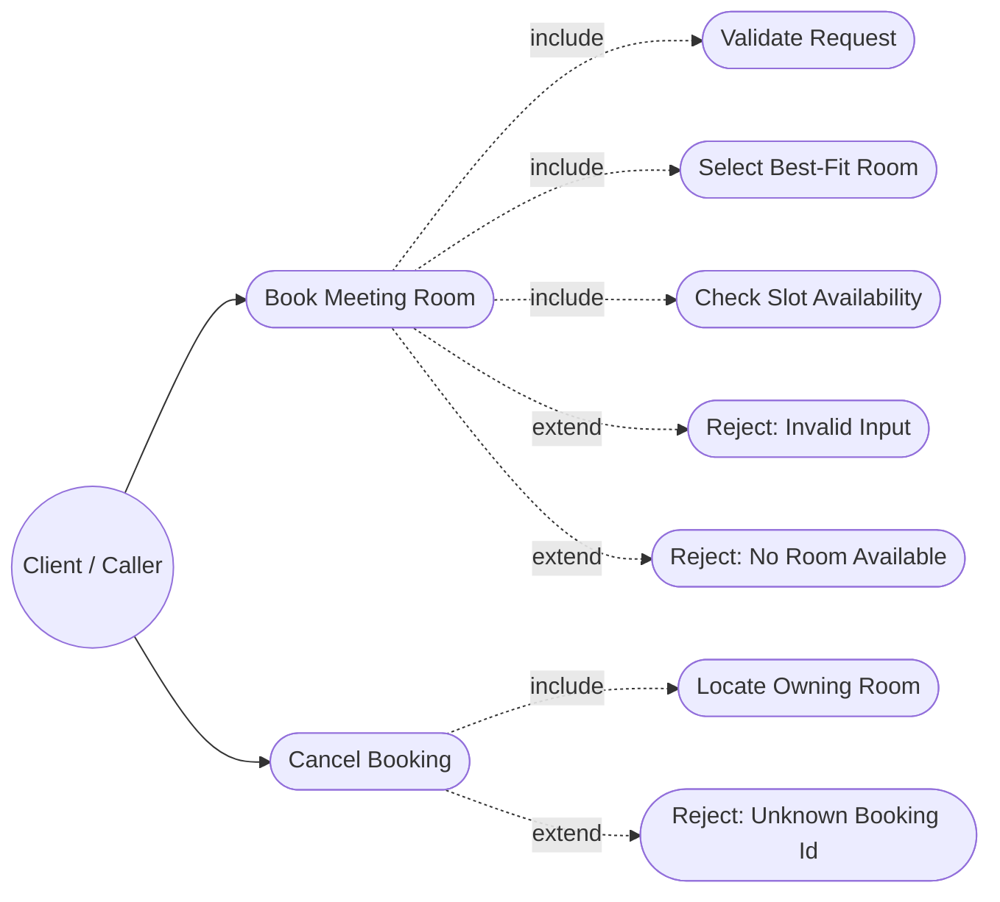
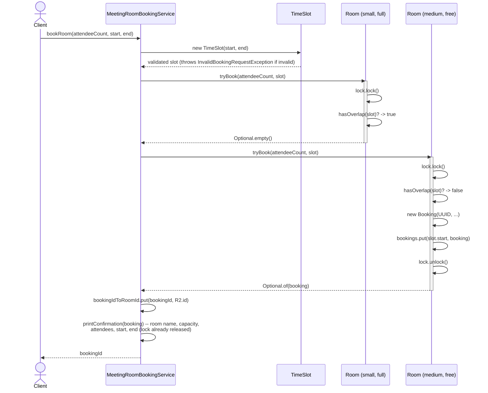
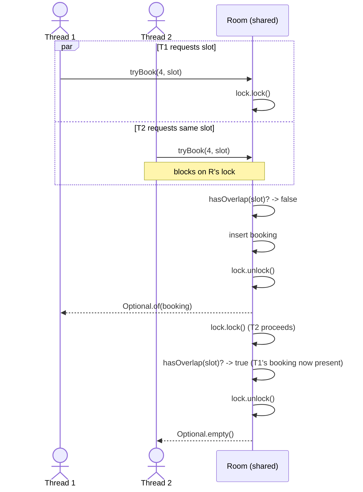
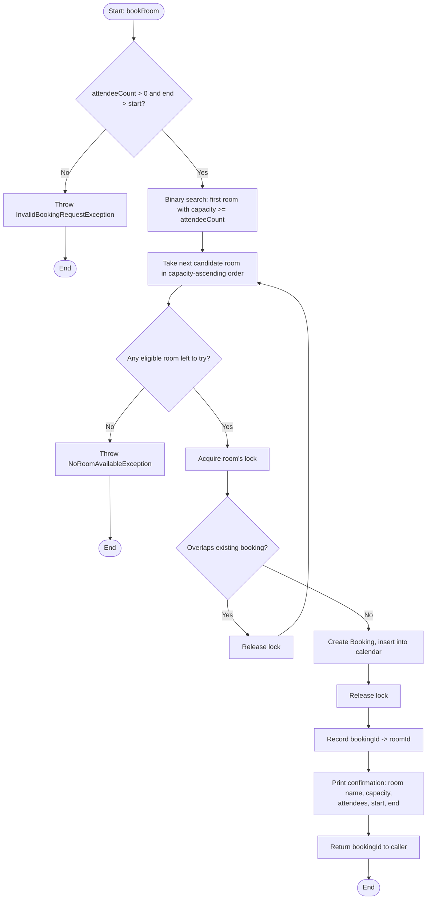

# Meeting Room Booking System

A single-host, thread-safe meeting room booking system. Given a desired capacity and a
`[start, end)` time interval, the system finds the smallest room that fits and is free for that
interval, confirms the reservation, and returns a booking ID. If no eligible room is free, it
throws instead of silently degrading.

Every confirmed booking is printed with its room name, room capacity, attendee count, and start
and end time:

```
Booking confirmed | Room: Falcon (Small) | Capacity: 6 | Attendees: 4 | Start: 2026-01-05T10:00 | End: 2026-01-05T11:00 | Booking Id: a0562c7b-0940-457d-919f-883cd2eb95c0
Booking confirmed | Room: Eagle (Medium) | Capacity: 12 | Attendees: 5 | Start: 2026-01-05T10:00 | End: 2026-01-05T11:00 | Booking Id: f4353c21-9e1c-4269-adb4-c8bafa4dedc8
Booking confirmed | Room: Hawk (Large) | Capacity: 20 | Attendees: 16 | Start: 2026-01-05T10:30 | End: 2026-01-05T11:30 | Booking Id: d52f204b-f00b-43bb-b0f8-8d1f91045694
```

## Table of Contents

1. [Table of Contents](#table-of-contents)
2. [Package / Folder Details](#package--folder-details)
3. [Request Flow](#request-flow)
4. [Diagrams](#diagrams)
   - [Use Case Diagram](#use-case-diagram)
   - [Class Diagram](#class-diagram)
   - [Sequence Diagram](#sequence-diagram)
   - [Activity Diagram](#activity-diagram)
5. [Data Structures and Complexity](#data-structures-and-complexity)
6. [Design Patterns](#design-patterns)
7. [Extending the Design](#extending-the-design)

---

## Package / Folder Details

```
meetingscheduler/
├── package-info.java          Design summary (also embedded as Javadoc)
├── MeetingSchedulerDemo.java  Runnable worked example (main)
├── model/
│   ├── TimeSlot.java          Immutable [start, end) range + overlap check
│   ├── Booking.java           Immutable confirmed-reservation receipt
│   └── Room.java              A room: capacity + its own lock + its own calendar
├── exception/
│   ├── InvalidBookingRequestException.java     Bad input (capacity <= 0, end <= start)
│   ├── InvalidRoomConfigurationException.java  Service built with a null/empty room inventory
│   └── NoRoomAvailableException.java           No eligible room is free
├── service/
│   ├── BookingService.java                 Facade interface (bookRoom / cancelBooking)
│   └── MeetingRoomBookingService.java      Best-fit room selection + orchestration
└── test/
    └── TestRunner.java         Dependency-free correctness + concurrency test suite
```

### `model`
- **`TimeSlot`** — a half-open time range `[start, end)`. Half-open semantics mean a meeting
  ending at 10:00 does not conflict with one starting at 10:00. Validates `end > start` in its
  constructor so an invalid slot can never be constructed. `overlaps()` is the single source of
  truth for "do two intervals conflict."
- **`Booking`** — an immutable receipt: ID, room ID/name, **room capacity**, attendee count, and the
  `TimeSlot`. Returned to the caller as proof of a confirmed reservation; never mutated after
  creation. Carrying the room capacity on the receipt makes it self-describing, so the confirmation
  printout needs no lookup back into `Room`.
- **`Room`** — the unit of concurrency control. Each `Room` owns a private `ReentrantLock` and a
  `TreeMap<LocalDateTime, Booking>` keyed by booking start time. All reads/writes of that map
  happen only while holding the room's own lock. Because a room's existing bookings are always
  mutually non-overlapping (an invariant maintained by construction), a new candidate slot can
  only possibly conflict with the `floorEntry` (starts at-or-before the candidate) or the
  `ceilingEntry` (starts at-or-after it) — giving O(log n) availability checks instead of an O(n)
  scan.

### `exception`
All three extend `RuntimeException` (unchecked) — a booking failure is an expected, recoverable
business outcome, not a programming error, and callers shouldn't be forced to catch it if they
don't care (e.g., a batch job that just logs and moves on).
- **`InvalidBookingRequestException`** — malformed request (non-positive capacity, `end <= start`).
- **`NoRoomAvailableException`** — every capacity-eligible room is booked for the requested slot,
  or no room is large enough at all.
- **`InvalidRoomConfigurationException`** — the service was constructed with a `null` or empty room
  inventory. Kept distinct from the other two because it is a setup-time configuration error, not a
  per-request failure -- callers may reasonably want to fail fast at startup for this one while
  handling the per-request exceptions per call (e.g., as an HTTP 4xx response).

### `service`
- **`BookingService`** — the public contract: `bookRoom(attendeeCount, start, end) -> bookingId`
  and `cancelBooking(bookingId) -> boolean`. This is the only type client code should depend on.
- **`MeetingRoomBookingService`** — the sole implementation. Holds an immutable list of rooms
  pre-sorted ascending by capacity (computed once at construction) and two `ConcurrentHashMap`
  indexes (`bookingId -> roomId`, `roomId -> Room`) for O(1) cancellation lookups. Holds **no
  global lock** — all mutual exclusion is delegated to individual `Room` instances, so requests
  for different rooms proceed in true parallel.

### `test`
- **`TestRunner`** — a small, dependency-free (no JUnit) test harness using plain assertions.
  Covers overlap rejection, back-to-back bookings, best-fit selection, capacity spillover,
  invalid input, cancellation, and two concurrency scenarios (race for one slot, parallel bookings
  across independent rooms). Run with:
  `java -cp out com.lowleveldesign.meetingscheduler.test.TestRunner`

### Top level
- **`MeetingSchedulerDemo`** — a runnable `main` that walks through best-fit selection, overlap
  rejection, capacity spillover (the "16 members can use a 20-person room" case), cancellation,
  and a 20-thread race for a single room/slot, printing the outcome of each step.

---

## Request Flow

### Successful booking
1. Caller invokes `bookingService.bookRoom(attendeeCount, start, end)`.
2. `MeetingRoomBookingService` validates `attendeeCount > 0`; constructing the `TimeSlot` validates
   `end > start`. Either failure throws `InvalidBookingRequestException` immediately — no lock is
   ever taken for a malformed request.
3. The service walks its **pre-sorted, capacity-ascending** room list and skips any room whose
   capacity is below `attendeeCount` (no lock needed for this cheap check).
4. For the first capacity-eligible room, it calls `room.tryBook(attendeeCount, slot)`:
   - The room acquires **its own** lock.
   - It checks the `floorEntry`/`ceilingEntry` around `slot.start` in its calendar for an overlap.
   - If free, it mints a new UUID, builds an immutable `Booking`, inserts it into the calendar, and
     returns it — all still inside the lock, so the check-then-act is atomic.
   - The lock is released.
5. If a booking was returned, the service records `bookingId -> roomId` for later cancellation,
   prints the confirmation (room name, room capacity, attendee count, start and end time), and
   returns the booking ID to the caller. The print happens **after** the room's lock has been
   released, and the whole line is assembled into a single string before being written, so console
   I/O never occurs under a lock and concurrent confirmations cannot interleave mid-line.
6. If the room was full or too small, the service moves to the **next best-fit candidate** (next
   smallest capacity) and repeats step 4.
7. If every capacity-eligible room is exhausted with no success, `NoRoomAvailableException` is
   thrown.

### Cancellation
1. `cancelBooking(bookingId)` looks up the owning room via the `bookingId -> roomId` index.
2. If found, delegates to `room.cancel(bookingId)`, which takes the room's lock, removes the entry
   from its calendar, and frees that slot for future bookings.

### Concurrent requests (why it's safe)
- **Different rooms, same or different slots** — no contention. Each `Room`'s lock is independent,
  so N threads booking N different rooms run in true parallel.
- **Same room, overlapping slots** — serialized by that one room's lock. Only one thread can be
  inside `tryBook` at a time, so the overlap-check-then-insert sequence is atomic: two threads
  racing for the same slot always produce exactly one winner and one clean rejection, never a
  double-booking.
- **Same room, disjoint slots** — also serialized (coarse-grained per room), but each call is O(log
  n), so throughput is still high; see [Extending the Design](#extending-the-design) for a
  finer-grained alternative.

---

## Diagrams

### Use Case Diagram



The client only ever interacts with two use cases — **Book Meeting Room** and **Cancel
Booking** — exposed through the `BookingService` facade. Everything else (validation, best-fit
selection, availability checks, and the two rejection paths) is internal behavior included or
triggered as an extension of those two primary use cases.

### Class Diagram

```mermaid
classDiagram
    direction LR

    class BookingService {
        <<interface>>
        +bookRoom(attendeeCount int, start LocalDateTime, end LocalDateTime) String
        +cancelBooking(bookingId String) boolean
    }

    class MeetingRoomBookingService {
        -roomsByCapacityAscending List~Room~
        -capacitiesAscending int[]
        -roomsById Map~String, Room~
        -bookingIdToRoomId Map~String, String~
        +bookRoom(attendeeCount int, start LocalDateTime, end LocalDateTime) String
        +cancelBooking(bookingId String) boolean
        -firstRoomFitting(attendeeCount int) int
        -printConfirmation(booking Booking) void
    }

    class Room {
        -id String
        -name String
        -capacity int
        -lock ReentrantLock
        -bookings TreeMap~LocalDateTime, Booking~
        -bookingIdToStart Map~String, LocalDateTime~
        +tryBook(attendeeCount int, slot TimeSlot) Optional~Booking~
        +cancel(bookingId String) boolean
        -hasOverlap(slot TimeSlot) boolean
    }

    class TimeSlot {
        <<immutable>>
        -start LocalDateTime
        -end LocalDateTime
        +overlaps(other TimeSlot) boolean
    }

    class Booking {
        <<immutable>>
        -id String
        -roomId String
        -roomName String
        -roomCapacity int
        -attendeeCount int
        -timeSlot TimeSlot
    }

    class InvalidBookingRequestException {
        <<RuntimeException>>
    }

    class NoRoomAvailableException {
        <<RuntimeException>>
    }

    class InvalidRoomConfigurationException {
        <<RuntimeException>>
    }

    BookingService <|.. MeetingRoomBookingService : implements
    MeetingRoomBookingService "1" o-- "many" Room : orchestrates
    Room "1" *-- "many" Booking : owns (guarded by its lock)
    Booking "1" --> "1" TimeSlot : has
    MeetingRoomBookingService ..> NoRoomAvailableException : throws
    MeetingRoomBookingService ..> InvalidBookingRequestException : throws (via TimeSlot)
    MeetingRoomBookingService ..> InvalidRoomConfigurationException : throws (constructor)
    TimeSlot ..> InvalidBookingRequestException : throws
```



### Sequence Diagram

**Successful booking, with a rejected-then-accepted candidate room:**



**Concurrent race for the same room and slot (only one winner):**



### Activity Diagram



---

## Data Structures and Complexity

Notation: **R** = number of rooms, **n** = bookings held by one room, **B** = total bookings.

| Structure | Choice | Time | Space | Why this and not something else |
|---|---|---|---|---|
| `Room.bookings` | `TreeMap<LocalDateTime, Booking>` | O(log n) overlap check, insert, remove | O(n) | The core operation is a **range/neighbour query**, which is exactly what a sorted map does well. A `HashMap` can't answer "what booking is nearest this time" at all; an `ArrayList` would make every overlap check an O(n) scan. Since existing bookings are non-overlapping by construction, only the `floorEntry` and `ceilingEntry` around the candidate start can possibly conflict — so two O(log n) probes settle it, no matter how full the calendar is. |
| `Room.bookingIdToStart` | `HashMap<String, LocalDateTime>` | O(1) lookup, so cancel is O(log n) | O(n) | Without it, cancellation had to scan the whole calendar to find a booking by ID — O(n). This secondary index trades one extra pointer per booking for an order-of-magnitude better cancel. Both maps are mutated in the same critical section, so they cannot drift apart. |
| `MeetingRoomBookingService.roomsByCapacityAscending` + `capacitiesAscending` | `ArrayList<Room>` sorted once + parallel `int[]` | O(log R) to find the first eligible room | O(R) | Sorting once at construction keeps it off the hot path. The parallel primitive array allows a **binary search (lower bound)** for the smallest sufficient capacity, so a 16-person request never walks past the small rooms. The `int[]` also avoids `Integer` boxing on every comparison. |
| `bookingIdToRoomId`, `roomsById` | `ConcurrentHashMap` | O(1) | O(B), O(R) | Cancellation needs to route an ID to its owning room without touching every room. These are the only structures shared across threads outside a room's lock, so they must be concurrent; they're only ever `put`/`remove`/`get`, never compound read-modify-write, so `ConcurrentHashMap` alone is sufficient. |
| `Room.lock` | one `ReentrantLock` per room | — | O(R) | Per-room rather than one global lock, so N threads booking N different rooms never contend. See the concurrency notes above. |

**Resulting cost of a booking:** O(log R) to locate the first eligible room, then O(log n) per room
actually probed. Best case (the smallest fitting room is free) is **O(log R + log n)**. The worst
case is O(log R + k·log n) where k is the number of eligible rooms that turn out to be busy —
unavoidable for a best-fit policy, since "is a closer-fitting room free?" can only be answered by
asking. Cancellation is **O(1) + O(log n)**. Total space is **O(R + B)**.

**Known trade-off:** the room lock is held for the whole check-and-insert, so two bookings on the
*same* room but completely unrelated days still serialize. That's a deliberate simplicity choice at
this scale; [Extending the Design](#extending-the-design) describes the striped/interval-tree
locking that would remove it.

---

## Design Patterns

| Class / Area | Pattern | Why it was chosen |
|---|---|---|
| `BookingService` (interface) + `MeetingRoomBookingService` | **Facade** | Client code needs one simple entry point (`bookRoom` / `cancelBooking`) without knowing about room iteration, best-fit ordering, or per-room locking. The facade hides that orchestration behind two methods. |
| `Room` | **Monitor Object** | Each `Room` bundles the state it protects (its booking calendar) together with the lock that guards it (`ReentrantLock`) and only exposes synchronized operations (`tryBook`, `cancel`). Callers can never touch the calendar without going through the lock, which is what makes the "no overlapping bookings" invariant impossible to violate by mistake. |
| `TimeSlot`, `Booking` | **Immutable Value Object** | Both are plain data with no setters and are fully constructed (and validated) in their constructor. Immutability means a `Booking`, once handed back to a caller or stored in a room's calendar, can never be silently corrupted by another thread — this is what lets `Room` share `Booking` references across threads without extra copying or locking. |
| `Room.tryBook` returning `Optional<Booking>` | **Special Case / Null Object (via `Optional`)** | "No room available right now" is a normal, expected outcome, not an error at the `Room` level (the error is only raised once *every* candidate room has been tried, in the service). Returning `Optional.empty()` avoids null checks and makes "did it work?" explicit at the call site. |
| `InvalidBookingRequestException`, `NoRoomAvailableException`, `InvalidRoomConfigurationException` | **Domain-Specific Exception (Unchecked)** | Three distinct failure modes (bad per-request input, no capacity, bad service setup) get distinct types so callers can `catch` selectively; all are unchecked because each is an expected business condition a caller may reasonably choose not to handle explicitly (e.g., letting a per-request failure propagate to an HTTP 4xx handler, or a configuration failure crash the app at startup). |
| Capacity-ascending room list + iteration in `bookRoom` | **Strategy (embedded)** | The "try smallest sufficient room first" rule is the room-selection strategy. It currently lives inline in `MeetingRoomBookingService` rather than behind a separate interface because there is only one strategy today — see below for how to promote it to a first-class `Strategy` pattern when a second policy is needed. |
| `MeetingRoomBookingService`'s `bookingIdToRoomId` / `roomsById` maps | **(Lightweight) Repository** | Provides O(1) lookup from a booking ID back to its owning room for cancellation, so the service doesn't need to linearly scan every room's calendar. |

---

## Extending the Design

### More room-selection strategies
The best-fit rule is currently inlined as "capacity-ascending list, first match wins." To support
multiple policies (e.g., load-balancing across equally-sized rooms, preferring rooms on a specific
floor, worst-fit to keep small rooms free for small meetings), extract it behind a real Strategy:

```java
public interface RoomSelectionStrategy {
    List<Room> orderCandidates(List<Room> eligibleRooms, int attendeeCount, TimeSlot slot);
}
```

`MeetingRoomBookingService` would take a `RoomSelectionStrategy` in its constructor and call
`strategy.orderCandidates(...)` instead of iterating its own pre-sorted list. This also opens the
door to context-aware strategies (e.g., "prefer a room with video conferencing if attendeeCount is
large") without touching the booking/locking logic at all.

### More multithreading / finer-grained concurrency
- **Per-slot / interval-tree locking instead of per-room locking.** Today a whole room is
  serialized even for two bookings on completely different days. Replacing the single
  `ReentrantLock` per room with a striped lock keyed by, say, the day of the booking (or an
  interval tree with fine-grained locks per node) would let unrelated slots on the same room book
  in parallel too.
- **Read-write separation.** Availability *queries* (e.g., "show me free slots this week") could
  use a `ReadWriteLock` per room so many readers don't block each other, only writers (actual
  `tryBook`/`cancel` calls) take the exclusive path.
- **Lock-free calendar via CAS.** For very high contention on a single popular room, the
  `TreeMap` + `ReentrantLock` could be replaced with an immutable persistent tree swapped in via
  `AtomicReference.compareAndSet`, avoiding blocking entirely at the cost of repeated retries under
  contention.

### More parallelism
- **Parallel candidate search.** `bookRoom` currently tries candidate rooms sequentially. For a
  very large room inventory, candidates could be probed with `CompletableFuture`s fired in
  parallel (still best-fit order respected by only accepting the first success from the
  smallest-capacity room that responds), reducing tail latency when many rooms are contended.
- **Batch/bulk booking requests** (e.g., booking a recurring weekly meeting across many weeks)
  could be parallelized per-occurrence using an `ExecutorService`, with a rollback/compensation
  step if any occurrence fails, since each individual `tryBook` call is already atomic.

### Moving beyond a single host
The prompt scopes this to a single host, but the seams for scaling out are visible:
- Replace `Room`'s in-memory `TreeMap` + `ReentrantLock` with a persisted calendar table and use a
  **per-room row lock or `SELECT ... FOR UPDATE`** (or a distributed lock, e.g., Redis
  `SET NX`/Redlock) as the equivalent of today's `ReentrantLock`.
- Replace the `ConcurrentHashMap` indexes in `MeetingRoomBookingService` with a real index table
  (`booking_id -> room_id`) so cancellation lookups survive process restarts and work across
  multiple service instances.
- The best-fit selection logic itself is stateless and would port over unchanged — only the
  storage and locking primitives need to change.
