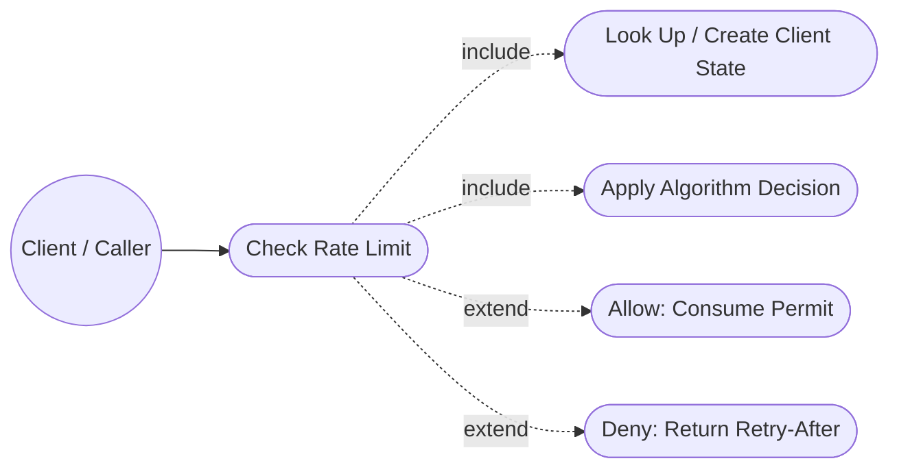
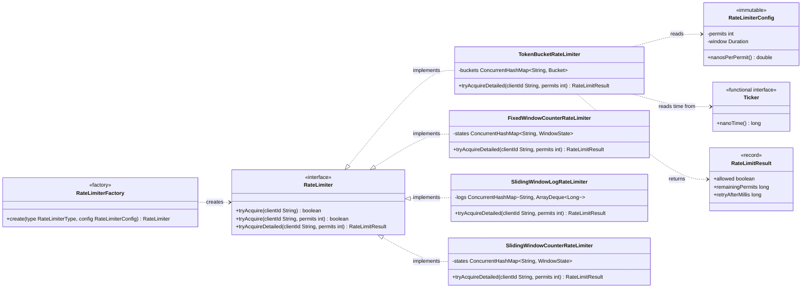
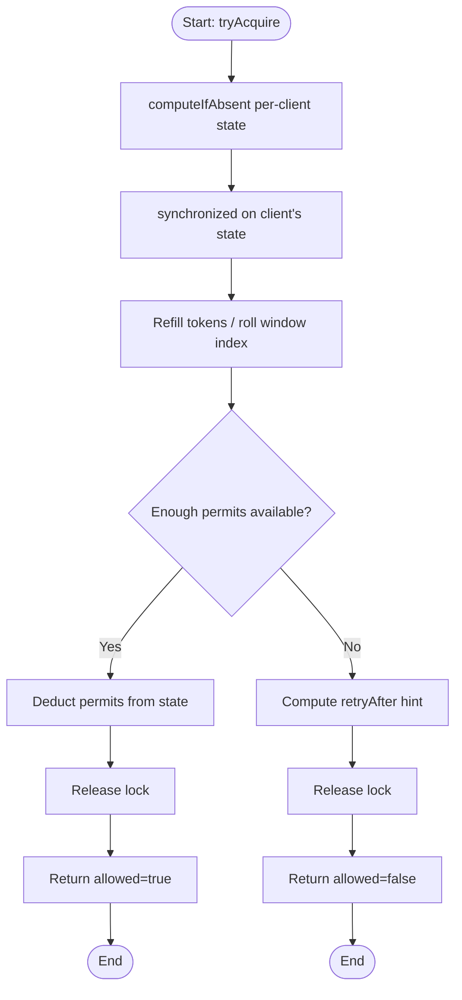

# Rate Limiter

A multi-tenant rate limiter: one `RateLimiter` instance enforces a single policy ("allow at
most N requests per window") across many independent clients (API key / user id / IP), with a
choice of four interchangeable algorithms behind the same interface.

## Table of Contents

1. [Table of Contents](#table-of-contents)
2. [Package / Folder Details](#package--folder-details)
3. [Request Flow](#request-flow)
4. [Diagrams](#diagrams)
   - [Use Case Diagram](#use-case-diagram)
   - [Class Diagram](#class-diagram)
   - [Sequence Diagram](#sequence-diagram)
   - [Activity Diagram](#activity-diagram)
5. [Algorithm Comparison](#algorithm-comparison)
6. [Design Patterns](#design-patterns)
7. [Extending the Design](#extending-the-design)

---

## Package / Folder Details

```
ratelimiter/
├── package-info.java              Design summary (also embedded as Javadoc)
├── RateLimiterDemo.java            Runnable worked example (main)
├── model/
│   ├── RateLimiterConfig.java      Immutable "permits per window" policy
│   ├── RateLimitResult.java        allowed + remaining + retryAfterMillis (record)
│   └── Ticker.java                 Pluggable time source (system clock / fake clock for tests)
├── service/
│   ├── RateLimiter.java                        Facade interface (tryAcquire / tryAcquireDetailed)
│   ├── RateLimiterType.java                    Enum of supported algorithms
│   ├── RateLimiterFactory.java                  Factory + Strategy: type -> RateLimiter
│   ├── TokenBucketRateLimiter.java              Lazy-refill token bucket
│   ├── FixedWindowCounterRateLimiter.java       Epoch-aligned fixed window counter
│   ├── SlidingWindowLogRateLimiter.java         Exact per-request timestamp log
│   └── SlidingWindowCounterRateLimiter.java     Weighted-previous-window approximation
└── test/
    └── TestRunner.java              Dependency-free correctness + concurrency test suite
```

### `model`
- **`RateLimiterConfig`** — immutable policy: `permits` and `window` (a `Duration`). Every
  algorithm reads the same two numbers; token bucket additionally derives capacity = `permits`
  and refill rate = `permits/window` from it (`nanosPerPermit()`).
- **`RateLimitResult`** — a record capturing `allowed`, `remainingPermits`, and
  `retryAfterMillis`, mirroring real-world `X-RateLimit-Remaining` / `Retry-After` response
  headers so a web layer can populate them directly.
- **`Ticker`** — a one-method functional interface (`nanoTime()`). Production code uses
  `Ticker.systemTicker()`; tests inject a fake, manually-advanced ticker so window/refill
  boundaries can be asserted exactly instead of relying on `Thread.sleep`.

### `service`
- **`RateLimiter`** — the public contract: `tryAcquire(clientId[, permits])` and
  `tryAcquireDetailed(clientId[, permits])`. This is the only type client code should depend on.
- **`RateLimiterFactory`** — `create(RateLimiterType, RateLimiterConfig[, Ticker])`. Client code
  picks an algorithm by enum value without referencing implementation classes.
- **`TokenBucketRateLimiter`** — per-client bucket holding up to `permits` tokens, refilled
  lazily (on access) at `permits/window` tokens/nanosecond. Allows bounded bursts up to
  `permits`, then throttles to the steady-state rate.
- **`FixedWindowCounterRateLimiter`** — per-client counter reset whenever the epoch-aligned
  window index changes. Cheapest algorithm; allows a boundary-burst of up to `2x permits`.
- **`SlidingWindowLogRateLimiter`** — per-client `ArrayDeque<Long>` of accepted-request
  timestamps; evicts entries older than `now - window` on every call. Exact, no approximation,
  O(permits) memory per client.
- **`SlidingWindowCounterRateLimiter`** — per-client current/previous window counters, blended
  by a linearly-decaying overlap fraction. O(1) memory approximation of the sliding window log
  that smooths the fixed window's boundary burst.

Every implementation keys its per-client state in a `ConcurrentHashMap<String, State>` and uses
`synchronized (state)` on that per-client object as its lock — the same "Monitor Object" pattern
this repo's `meetingscheduler.Room` uses for per-room locking. Unrelated clients never contend;
concurrent requests for the *same* client are serialized so the check-then-consume sequence is
atomic.

### `test`
- **`TestRunner`** — a small, dependency-free (no JUnit) test harness using plain assertions and
  a fake `Ticker`. Covers token-bucket burst/throttle/refill, fixed-window reset and its known
  boundary-burst weakness, sliding-window-log exact eviction and retry-after accuracy, sliding-
  window-counter smoothing, per-client isolation, and a 100-thread race for one client's tokens.
  Run with: `java -cp out com.lowleveldesign.ratelimiter.test.TestRunner`

### Top level
- **`RateLimiterDemo`** — a runnable `main` walking through all four algorithms (including the
  fixed-window boundary burst and its sliding-window-counter fix) and a 20-thread race for a
  single client's token bucket.

---

## Request Flow

### `tryAcquire(clientId, permits)` (generic across algorithms)
1. `RateLimiterFactory.create(type, config)` builds the chosen implementation once; it is reused
   across all clients and requests.
2. On each call, the implementation does `perClientState.computeIfAbsent(clientId, ...)` to fetch
   or lazily create that client's state (bucket / window counters / log) — no pre-registration
   step needed for new clients.
3. It `synchronized`s on that client's state object only (never a global lock), then:
   - **Token bucket** — refills tokens based on elapsed time since last touch, then spends
     `permits` tokens if enough are available.
   - **Fixed window** — recomputes `now / windowSize` as the current window index; resets the
     counter if the window changed; allows if `count + permits <= config.permits()`.
   - **Sliding window log** — evicts timestamps older than `now - window` from the front of the
     deque; allows if the remaining log size is below `config.permits()`, then appends `now`.
   - **Sliding window counter** — rolls `currentCount` into `previousCount` if the window
     advanced; computes `estimated = previousCount * overlapFraction + currentCount`; allows if
     `estimated + permits <= config.permits()`.
4. Returns a `RateLimitResult` (allowed + remaining + retry-after hint); `tryAcquire` unwraps just
   the boolean.

### Why concurrent requests are safe
- **Different clients** — no contention. Each client's state lives behind its own map entry and
  lock; N threads acting for N different clients run in true parallel.
- **Same client, concurrent requests** — serialized by that client's own monitor lock, so the
  read-check-consume sequence can never race (verified by the 100-thread test that exactly
  `permits` requests win when far more threads race simultaneously).

---

## Diagrams

### Use Case Diagram



### Class Diagram



### Sequence Diagram

**Token bucket: allow, then deny once exhausted:**

```mermaid
sequenceDiagram
    actor Client
    participant Limiter as TokenBucketRateLimiter
    participant Map as ConcurrentHashMap~clientId, Bucket~
    participant Bucket

    Client->>Limiter: tryAcquire("client-A")
    Limiter->>Map: computeIfAbsent("client-A")
    Map-->>Limiter: Bucket (tokens=capacity)
    Limiter->>Bucket: synchronized { refill(); tokens -= 1 }
    Bucket-->>Limiter: allowed=true, remaining=capacity-1
    Limiter-->>Client: true

    Note over Client,Bucket: ... capacity more requests spend the rest of the burst ...

    Client->>Limiter: tryAcquire("client-A")
    Limiter->>Map: computeIfAbsent("client-A")
    Map-->>Limiter: Bucket (tokens=0)
    Limiter->>Bucket: synchronized { refill(); tokens < 1 }
    Bucket-->>Limiter: allowed=false, retryAfterMs=...
    Limiter-->>Client: false
```

### Activity Diagram



---

## Algorithm Comparison

| Algorithm | Memory / client | Accuracy | Burst behavior | Notes |
|---|---|---|---|---|
| **Token Bucket** | O(1) | Exact for its own model | Allows a burst up to `permits`, then smooth steady-state rate | Good general-purpose default |
| **Fixed Window Counter** | O(1) | Approximate | Up to `2x permits` can land in a short span straddling a window boundary | Cheapest; simplest to reason about |
| **Sliding Window Log** | O(permits) | Exact | None — enforces the true rolling window | Best accuracy, higher memory for large `permits` |
| **Sliding Window Counter** | O(1) | Close approximation | Boundary burst smoothed via weighted previous-window count | Best accuracy/memory trade-off for large `permits` |

---

## Design Patterns

| Class / Area | Pattern | Why it was chosen |
|---|---|---|
| `RateLimiter` + `RateLimiterFactory` + `RateLimiterType` | **Strategy + Factory** | Client code depends only on `RateLimiter`; the concrete algorithm is chosen by enum value at construction time, so swapping token bucket for sliding window log is a one-line change. |
| Per-client `Bucket` / `WindowState` (own lock via `synchronized(state)`) | **Monitor Object** | Each client's mutable state is bundled with the lock that guards it. Two clients never contend; a single client's read-modify-write is always atomic. Same pattern as `meetingscheduler.Room`. |
| `RateLimiterConfig`, `RateLimitResult` | **Immutable Value Object** | Both are fully constructed (and validated) up front with no setters, so they can be freely shared across threads without extra synchronization. |
| `Ticker` | **Dependency Injection / Strategy** | Decouples every algorithm from `System.nanoTime()`, letting tests substitute a deterministic fake clock instead of sleeping and hoping timing works out. |
| `tryAcquireDetailed` returning `RateLimitResult` rather than throwing | **Special Case (via a result object)** | "Rate limited" is an expected, frequent outcome, not an error — returning a result object avoids exceptions-as-control-flow and gives callers the data needed for `Retry-After` headers. |
| `ConcurrentHashMap<String, State>` in every implementation | **(Lightweight) Repository** | O(1) average lookup/creation of per-client state without a separate registration step or a global lock guarding the whole map. |

---

## Extending the Design

### Distributed rate limiting
State here is in-process, correct for a single host or sticky routing. To share a limit across
many service instances:
- **Fixed window / token bucket** — a Redis `INCR`/`EXPIRE` (fixed window) or a small Lua script
  doing the refill-and-decrement atomically (token bucket) replaces the in-memory map + lock.
- **Sliding window log** — a Redis sorted set per client (score = timestamp) with `ZREMRANGEBYSCORE`
  to evict and `ZCARD` to count, wrapped in a `MULTI`/Lua script for atomicity.
- The algorithms' *logic* is unchanged; only the storage/atomicity primitive moves from an
  in-process lock to a remote atomic operation.

### Tiered / composite limits
A client might need "100/minute AND 1000/hour" simultaneously. This composes cleanly: wrap
multiple `RateLimiter`s behind a `CompositeRateLimiter` that calls `tryAcquire` on each and only
commits if *all* would allow (requires a two-phase check-then-commit per limiter, or accepting
each sub-limiter's own atomicity and treating a partial "already consumed on limiter 1, denied on
limiter 2" as an accepted trade-off / adding a rollback path).

### Weighted / cost-based requests
`tryAcquire(clientId, permits)` already supports spending more than 1 permit per request (e.g. an
expensive bulk-export endpoint costing 20 permits instead of 1), letting the same limiter police
heterogeneous endpoint costs without new abstractions.
