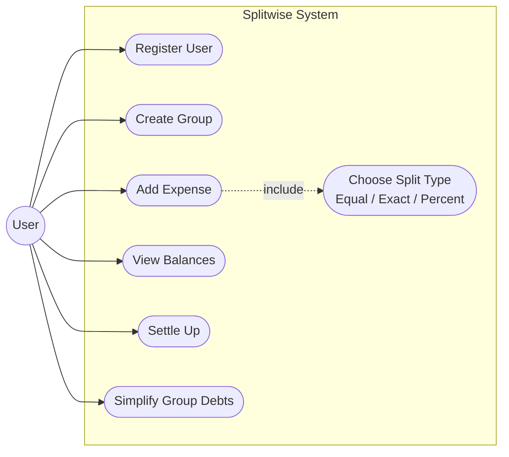
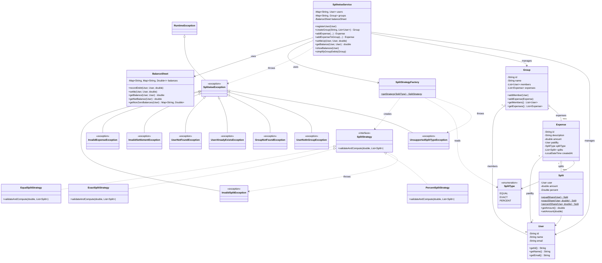
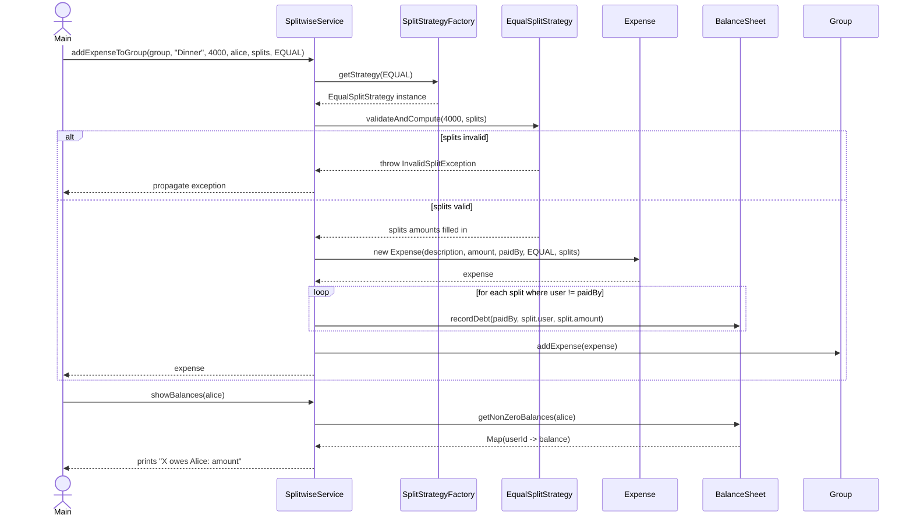
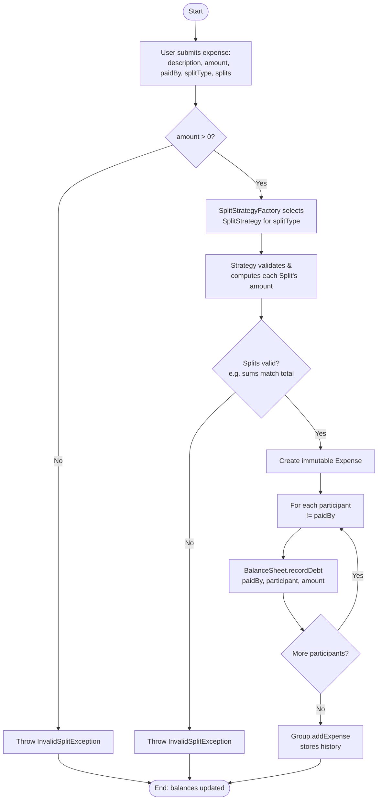

# Splitwise – Low Level Design

A simplified, in-memory clone of Splitwise: users can be grouped together,
expenses can be added with **EQUAL**, **EXACT** or **PERCENT** splits, a
running balance sheet tracks who-owes-whom, users can settle up in cash, and
group debts can be simplified to the minimum number of transactions.

## Table of Contents

1. [Folder Structure](#folder-structure)
2. [Folder Details](#folder-details)
   - [model](#model)
   - [split](#split)
   - [service](#service)
   - [exception](#exception)
   - [Main.java](#mainjava)
3. [Diagrams](#diagrams)
   - [Use Case Diagram](#use-case-diagram)
   - [Class Diagram](#class-diagram)
   - [Sequence Diagram](#sequence-diagram)
   - [Activity Diagram](#activity-diagram)
4. [Flow of the Application](#flow-of-the-application)
5. [Design Patterns Used](#design-patterns-used)
6. [Extending the Design](#extending-the-design)
   - [Adding New Split Strategies](#adding-new-split-strategies)
   - [Multithreading, Concurrency & Parallelism](#multithreading-concurrency--parallelism)

## Folder Structure

```
splitwise/
├── package-info.java
├── Main.java
├── model/
│   ├── User.java
│   ├── Group.java
│   ├── Expense.java
│   ├── Split.java
│   └── SplitType.java
├── split/
│   ├── SplitStrategy.java
│   ├── EqualSplitStrategy.java
│   ├── ExactSplitStrategy.java
│   ├── PercentSplitStrategy.java
│   └── SplitStrategyFactory.java
├── service/
│   ├── BalanceSheet.java
│   └── SplitwiseService.java
└── exception/
    ├── SplitwiseException.java
    ├── InvalidSplitException.java
    ├── InvalidExpenseException.java
    ├── InvalidSettlementException.java
    ├── UserNotFoundException.java
    ├── UserAlreadyExistsException.java
    ├── GroupNotFoundException.java
    ├── UserNotInGroupException.java
    └── UnsupportedSplitTypeException.java
```

## Folder Details

### `model`
Plain domain entities with no business logic beyond simple invariants.

| Class        | Responsibility |
|--------------|-----------------|
| `User`       | A person using the app (id, name, email). Equality is based on `id`. |
| `Group`      | A named collection of `User`s that share `Expense`s together (e.g. "Goa Trip"). Owns the list of members and the expense history. |
| `Expense`    | An immutable record of one payment: description, total amount, who paid (`paidBy`), the `SplitType` used, and the resulting list of `Split`s. |
| `Split`      | One participant's share of an `Expense` — the user, the amount they owe, and (for percent splits) the percentage. Exposes named factory methods (`equalShare`, `exactShare`, `percentShare`) instead of telescoping constructors. |
| `SplitType`  | Enum: `EQUAL`, `EXACT`, `PERCENT`. Selects which `SplitStrategy` to use. |

### `split`
Contains the pluggable algorithms that turn a total amount + raw participant
input into validated, final `Split` amounts.

| Class                  | Responsibility |
|------------------------|-----------------|
| `SplitStrategy`        | Interface with a single method `validateAndCompute(totalAmount, splits)`. |
| `EqualSplitStrategy`    | Divides the amount evenly; pushes any rounding remainder onto the first participant so the sum always matches the total exactly. |
| `ExactSplitStrategy`    | Validates that the caller-supplied exact amounts add up to the total. |
| `PercentSplitStrategy`  | Validates percentages sum to 100 and converts each to a currency amount. |
| `SplitStrategyFactory`  | Maps a `SplitType` to the right `SplitStrategy` implementation. |

### `service`
Application/orchestration layer — the only layer that mutates shared state.

| Class               | Responsibility |
|---------------------|-----------------|
| `BalanceSheet`      | The ledger. Keeps a symmetric `Map<userId, Map<userId, amount>>` of net balances between every pair of users, and exposes `recordDebt`, `settle`, `getBalance`, `getNetBalance`, `getNonZeroBalances`. |
| `SplitwiseService`  | Facade/entry point. Registers users, creates groups, adds expenses (delegating split math to a `SplitStrategy`), updates the `BalanceSheet`, settles balances, prints balances, and simplifies group debts. |

### `exception`

All domain exceptions are unchecked and extend a common base
`SplitwiseException`, so callers can either catch a specific type or catch
`SplitwiseException` to handle every business-rule violation in one place.

| Class                          | Thrown when |
|--------------------------------|-------------|
| `SplitwiseException`           | Base type for all exceptions below (never thrown directly). |
| `InvalidSplitException`        | Split input is invalid — exact amounts don't sum to the total, percentages don't sum to 100, or a percent is missing. |
| `InvalidExpenseException`      | The expense itself is invalid — non-positive amount, no participants, null user, or empty group name. |
| `InvalidSettlementException`   | A cash settlement is invalid — non-positive amount or a user settling up with themselves. |
| `UserNotFoundException`        | An operation references a user who was never registered with the service. |
| `UserAlreadyExistsException`   | Registering a user whose id is already in use. |
| `GroupNotFoundException`       | An operation references a group unknown to the service. |
| `UserNotInGroupException`      | A group expense's payer or participant is not a member of that group. |
| `UnsupportedSplitTypeException`| The factory is asked for a strategy for a `SplitType` with no implementation (or `null`). |

### `Main.java`
A runnable demo: registers 4 users, creates a group, adds one expense of each
split type, prints balances, simplifies the group's debts, and performs a
cash settlement.

## Diagrams

### Use Case Diagram



Every actor is a `User` of the app; `Add Expense` always includes selecting
one of the split-type use cases via the `SplitStrategy` chosen for that
expense.

### Class Diagram



### Sequence Diagram

Adding an expense to a group with an `EQUAL` split, and later viewing balances:



### Activity Diagram

End-to-end flow for adding an expense, from user input to the updated ledger:



## Flow of the Application

```
Main
 └─> SplitwiseService.registerUser(User)            // add users
 └─> SplitwiseService.createGroup(name, members)     // create a Group
 └─> SplitwiseService.addExpenseToGroup(...)
        │
        ├─> SplitStrategyFactory.getStrategy(splitType)   // pick strategy
        ├─> strategy.validateAndCompute(amount, splits)   // validate + fill amounts
        │      (throws InvalidSplitException on bad input)
        ├─> new Expense(...)                               // immutable record
        ├─> for each split != paidBy:
        │      BalanceSheet.recordDebt(paidBy, split.user, split.amount)
        └─> Group.addExpense(expense)                      // history
 └─> SplitwiseService.showBalances(user) / showAllBalances()
        └─> BalanceSheet.getNonZeroBalances(user)           // read-only query
 └─> SplitwiseService.settleUp(payer, payee, amount)
        └─> BalanceSheet.settle(...) -> recordDebt(...)     // cash settlement
 └─> SplitwiseService.simplifyGroupDebts(group)
        ├─> BalanceSheet.getNetBalance(user) for every member
        ├─> build max-heap of creditors / min-heap of debtors
        └─> greedily match biggest creditor <-> biggest debtor until settled
```

**Key invariant:** `BalanceSheet` is always symmetric —
`balance(a, b) == -balance(b, a)` — so the total money owed always nets to
zero across the whole ledger, which is what makes group-debt simplification
possible.

## Design Patterns Used

| Pattern                     | Where                                                              | Why it was chosen |
|------------------------------|---------------------------------------------------------------------|--------------------|
| **Strategy**                 | `SplitStrategy` + `EqualSplitStrategy` / `ExactSplitStrategy` / `PercentSplitStrategy` | Each split type has a distinct validation/computation algorithm. Strategy lets `SplitwiseService` treat them uniformly (`strategy.validateAndCompute(...)`) and lets us add new split types (e.g. `SHARES`) without touching existing code — Open/Closed Principle. |
| **Factory**                  | `SplitStrategyFactory`                                              | Centralizes the `SplitType -> SplitStrategy` mapping so callers never `new` a concrete strategy directly, keeping `SplitwiseService` decoupled from concrete strategy classes. |
| **Facade**                   | `SplitwiseService`                                                   | Client code (`Main`) only talks to one class instead of coordinating `BalanceSheet`, `SplitStrategyFactory`, `Group`, and `Expense` itself. Simplifies the public API and hides internal wiring. |
| **Static Factory Method**    | `Split.equalShare(...)`, `Split.exactShare(...)`, `Split.percentShare(...)` | More readable than overloaded/telescoping constructors and makes each split-type's required inputs explicit at the call site. |
| **Immutable Value Object**   | `Expense`, `User`, `Split`'s `user`/`percent` fields                 | Expenses are historical facts that must never change after creation; immutability prevents accidental post-hoc mutation and makes the object safe to share/read concurrently. |
| **Repository-ish Ledger**    | `BalanceSheet`                                                       | Encapsulates the balance data structure and all mutation/query rules (symmetry, rounding epsilon) behind a small API, so `SplitwiseService` never manipulates the raw map directly. |
| **Exception Hierarchy**      | `SplitwiseException` + `InvalidSplitException` / `InvalidExpenseException` / `InvalidSettlementException` / `UserNotFoundException` / `UserAlreadyExistsException` / `GroupNotFoundException` / `UserNotInGroupException` / `UnsupportedSplitTypeException` | A single unchecked base type lets callers catch every domain violation with one `catch (SplitwiseException e)`, while the specific subclasses carry precise semantics for targeted handling. Unchecked keeps the fluent service API free of `throws` clutter. |

## Extending the Design

### Adding New Split Strategies

To add a new split type (e.g. **SHARES**, where users hold weighted shares
like "2 shares" vs "1 share"):

1. Add a new constant to `SplitType`.
2. Implement `SplitStrategy` in a new `SharesSplitStrategy` class — compute
   each user's amount as `totalAmount * userShares / totalShares`.
3. Register it in `SplitStrategyFactory.getStrategy(...)`.
4. Optionally add a `Split.sharesShare(user, shares)` factory method if the
   raw input (shares) differs from percent/exact amount.

No changes are required in `SplitwiseService`, `BalanceSheet`, or `Expense`
— this is the Strategy pattern's Open/Closed benefit in action.

### Multithreading, Concurrency & Parallelism

The current implementation is single-threaded and uses plain `HashMap`s, so
it is **not** safe for concurrent use as-is. To make it production-ready:

- **Balance sheet contention**: Replace the nested `HashMap<String, HashMap<String, Double>>`
  in `BalanceSheet` with a `ConcurrentHashMap<String, ConcurrentHashMap<String, Double>>`,
  and use `merge`/`computeIfAbsent` (already used) which are atomic per-key —
  but the two-key update in `recordDebt` (updating both `a->b` and `b->a`)
  must be made atomic together, e.g. by acquiring a lock keyed on the
  **ordered pair** of user ids (`lock(min(idA,idB), max(idA,idB))`) to avoid
  deadlock and to prevent a reader observing a half-applied update.
- **Per-user locking**: Use a `ConcurrentHashMap<String, ReentrantLock>` (one
  lock per user pair, created lazily) instead of a single global lock, so
  expenses among disjoint sets of users can be processed in parallel.
- **Idempotency / at-least-once processing**: If expense creation is
  triggered by a distributed system (e.g. message queue) that may redeliver
  events, give `Expense` an idempotency key and have `SplitwiseService`
  de-duplicate before calling `recordDebt`.
- **Optimistic concurrency for `Group`**: Add a version number to `Group`
  and use compare-and-swap (`AtomicReference` or a version check) when
  multiple threads add expenses to the same group concurrently, instead of
  a plain `ArrayList`.
- **Parallelizing `simplifyGroupDebts`**: For very large groups, computing
  net balances for every member (`getNetBalance`) is embarrassingly
  parallel — it can be done with a parallel stream
  (`members.parallelStream().collect(...)`) since each user's net balance
  is independent. The greedy matching step itself is inherently sequential
  (it consumes from two priority queues), so it stays single-threaded, but
  it operates on a small, already-aggregated dataset (number of group
  members), so this is not a bottleneck.
- **Read/write separation**: Balance *reads* (`showBalances`, `getBalance`)
  vastly outnumber *writes* (`addExpense`, `settleUp`) in a typical usage
  pattern. A `ReadWriteLock` per user-pair (or a `CopyOnWriteArrayList` for
  each user's balance row) would let concurrent reads proceed without
  blocking each other while still serializing writes.
- **Event-driven scalability**: For a real distributed deployment, treat
  `addExpense`/`settleUp` as commands published to a queue and have a
  single consumer (or sharded consumers keyed by user-id hash) apply them
  to the ledger — this avoids fine-grained locking entirely by serializing
  writes per shard, at the cost of eventual consistency for balance reads.
